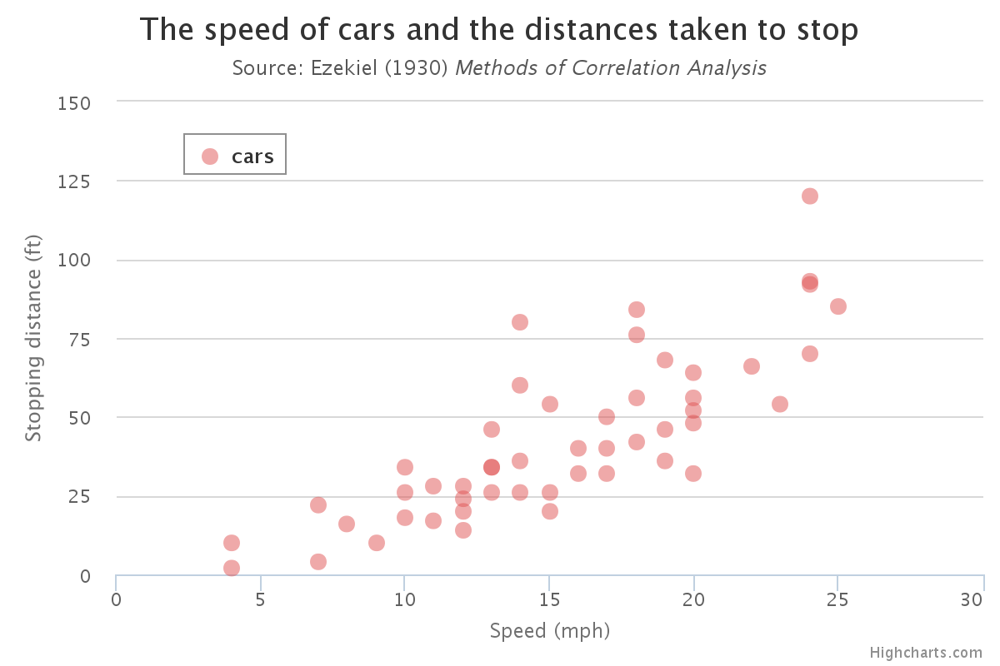

```{r}
summary(cars)
head(cars)
```

You can also embed plots, for example:

```{r, echo=FALSE}
plot(cars)
```

There are many option for toJSON.  The one that works best with Javascript data is `dataframe=c("values")`.
```{r}
library(jsonlite)
toJSON(cars)

toJSON(cars, dataframe=c("rows"))
toJSON(cars, dataframe=c("columns"))
toJSON(cars, dataframe=c("values"))
```


The usual R analysis from the documentation.
```{r}
plot(cars, xlab = "Speed (mph)", ylab = "Stopping distance (ft)",
     las = 1)
lines(lowess(cars$speed, cars$dist, f = 2/3, iter = 3), col = "red")
```

***

Now the same chart using [Highcharts](/highcharts/cars.html)



The [R source](./1970-01-01-R-to-JSON-Demo.Rmd) that made this document.