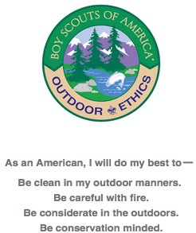

## Outdoor Ethics Orientation for Cub Scout Leaders

### BSA Outdoor code

### Outdoor Ethics at BSA
* [http://www.outdoorethics-bsa.org](http://www.outdoorethics-bsa.org)
* [OutdoorEthics Cub Action 2015](http://outdoorethics-bsa.org/awards/CubAction2015.php)
* [http://sdicbsa.org/Programs/OutdoorEthics/](http://sdicbsa.org/Programs/OutdoorEthics/)
* [http://www.scouting.org/Home/OutdoorProgram/OutdoorEthics/Awards/CubScout.aspx](http://www.scouting.org/Home/OutdoorProgram/OutdoorEthics/Awards/CubScout.aspx)

### Outdoor Ethics for Cub Scouts

* Know Before You Go
* Choose The Right Path
* Trash Your Trash
* Leave What You Find
* Be Careful With Fire
* Respect Wildlife
* Be Kind To Other Visitors

#### Scout Resources

* [http://outdoorethics-bsa.org/awards/CubAction2015.php](http://outdoorethics-bsa.org/awards/CubAction2015.php)
* [http://sdicbsa.org/Programs/OutdoorEthics/](http://sdicbsa.org/Programs/OutdoorEthics/)

* [Pack 709, Caughdenoy, New York](https://www.youtube.com/watch?v=UDPhlQqANng)
* [Bigfoot builds a fire](https://www.youtube.com/watch?v=-dWpjvW0Ecc)
* [Eco Spray](https://www.youtube.com/watch?v=QKBorb2jU3E)
* [Bigfoot visits the Grand Tetons](https://www.youtube.com/watch?v=ZLB2o1ZtuBg)

-----

### Outdoor Ethics links

#### Leave No Trace
[http://lnt.org](http://lnt.org)

The Seven Principles

* Plan Ahead and Prepare
* Travel and Camp on Durable Surfaces
* Dispose of Waste Properly
* Leave What You Find
* Minimize Campfire Impacts
* Respect Wildlife
* Be Considerate of Other Visitors

-----

#### Tread Lightly  
[http://TreadLightly.org](http://TreadLightly.org)

* __T__ravel Responsibly
* __R__espect the Rights of Others
* __E__ducate Yourself
* __A__void Sensitive Areas
* __D__o Your Part

[usgs]: http://store.usgs.gov/b2c_usgs/usgs/maplocator/(ctype=areaDetails&xcm=r3standardpitrex_prd&carea=%24ROOT&layout=6_1_61_48&uiarea=2)/.do
[usfs]:  http://data.fs.usda.gov/geodata/rastergateway/states-regions/grid_zoom.php?stateID=ca&gridSrc=32116
[caltopo]: http://caltopo.com/map.html#ll=36.5785,-118.29075&z=15&b=t
[ios]:  https://itunes.apple.com/us/app/mt-whitney-ep-maps/id1133292347?mt=8
[android]:  https://play.google.com/store/apps/details?id=com.roblabs.papermaps.whitney

[tsg]:  http://www.timestampgenerator.com

[tilejson-local-server-github]:  http://roblabs.github.io/blackmountain-leaflet/
